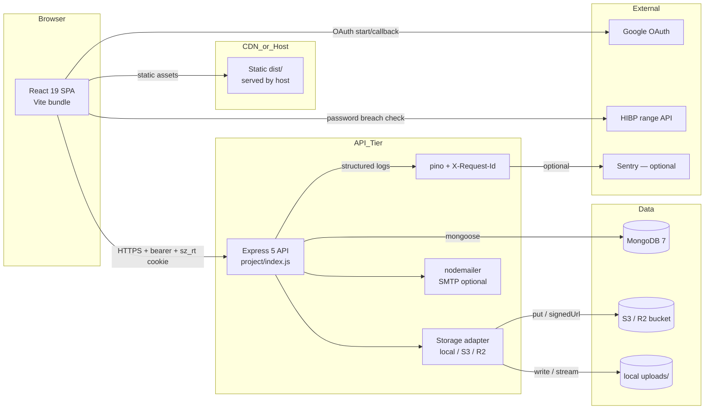

# ScholarshipZone

[](https://github.com/GilbertIrumva/scholarship-hub/actions/workflows/ci.yml)
[](#license)
[](#prerequisites)
[](#tech-stack)
[](#tech-stack)
[](#tech-stack)
[](#tech-stack)

> A full-stack scholarship discovery and application platform — search global
> scholarships, save favourites, apply through a guided multi-step wizard,
> manage academic credentials and travel documents, and track visa workflows
> end-to-end. Built with React 19 + Vite on the front end and Express 5 +
> Mongoose on the back end, with TOTP 2FA, refresh-token sessions, pluggable
> file storage, structured logging, Core Web Vitals ingestion, and
> Docker-ready graceful shutdown.

---

## Table of contents

- [Features](#features)
- [Tech stack](#tech-stack)
- [Repository layout](#repository-layout)
- [Architecture overview](#architecture-overview)
- [Prerequisites](#prerequisites)
- [Quick start — local development](#quick-start--local-development)
- [Quick start — Docker](#quick-start--docker)
- [Quick start — Render deployment](#quick-start--render-deployment)
- [Configuration (environment variables)](#configuration-environment-variables)
- [Scripts](#scripts)
- [Testing](#testing)
- [Continuous integration](#continuous-integration)
- [API surface](#api-surface)
- [Data model](#data-model)
- [Front-end pages & routes](#front-end-pages--routes)
- [Security model](#security-model)
- [Observability](#observability)
- [Internationalisation](#internationalisation)
- [Design system](#design-system)
- [Conventions](#conventions)
- [Troubleshooting](#troubleshooting)
- [License](#license)

---

## Features

### Scholar (student) experience
- **Discover** — faceted search over the public scholarship catalogue with
  country / grade / field / amount / deadline filters, sort options, and full
  URL-state so any filtered view is shareable.
- **Save / watchlist** — persistent per-account saved-scholarships list.
- **Apply** — 4-step application wizard (Personal → Academic → Documents →
  Review) with 800 ms debounced auto-save, draft resume, and attachment
  picker that re-uses uploaded credentials.
- **Track** — `My applications` page with status timeline; `Notifications`
  page with 30 s auto-poll, kind-aware grouping, and mark-as-read flow.
- **Credentials** — upload academic transcripts / certificates; files are
  stored either on local disk or in an S3/R2 bucket (env-switchable) and
  served back as presigned URLs or streamed responses.
- **Travel docs** — passport / visa records with the document number
  encrypted at rest (AES-256-GCM) and original PDFs/images stored through
  the same pluggable backend.
- **Visa workflow** — interactive timeline page that mirrors the admin-side
  workflow board.
- **Grade converter** — public utility page that converts grades across
  international scales.
- **Google OAuth** — optional one-click sign-in / sign-up for scholars via
  stateless HMAC-signed OAuth state (no server-side session store needed).
- **TOTP 2FA** — optional second factor with QR enrolment, 10 single-use
  backup codes, and a per-account session-management panel.

### Admin experience
- **Dashboard** — at-a-glance metrics (applications, applicants, messages,
  audit alerts) with recharts visualisations.
- **Applicants** — searchable / filterable applicant table, per-applicant
  detail page with full application history.
- **Messages** — inbox for contact-form submissions with reply flow (sends
  via SMTP when configured, otherwise stored + logged).
- **Audit log** — searchable, filterable view of every privileged action.
- **Credentials & travel docs** — review and download student-uploaded
  files through the same storage adapter.
- **Visa tracker** — manage per-applicant visa workflows with stage
  transitions and notes.
- **Settings** — provision admin accounts, manage TOTP, view & revoke
  active sessions.
- **Admin sign-in is password + TOTP only** — Google OAuth is intentionally
  scholar-only.

### Platform features
- **Refresh-token sessions** — short-lived bearer access tokens (15 min)
  paired with a long-lived rotating opaque refresh cookie (30 days), with
  reuse detection.
- **Pluggable storage** — `local` (disk) or `s3` (AWS S3 / Cloudflare R2)
  selected per-record so swapping backends mid-lifecycle never breaks
  access to existing files.
- **Structured JSON logging** — pino with per-request `X-Request-Id`,
  redaction of secrets, and silenced probe paths.
- **Health + readiness probes** — `/healthz` and `/readyz` (plus
  `/api/health` and `/api/ready` aliases) suitable for Kubernetes.
- **Graceful shutdown** — drains in-flight requests for up to
  `SHUTDOWN_GRACE_MS` (default 25 s) before closing the Mongo connection.
- **Core Web Vitals ingestion** — front-end ships CLS/LCP/INP/TTFB/FCP
  to `POST /api/_metrics/web-vitals` via `navigator.sendBeacon`, stored
  with a 7-day TTL.
- **i18n** — English + French translations through i18next.
- **Dark mode** — design-token-driven, with a pre-paint script in
  `index.html` to avoid the white flash.
- **Command palette** — ⌘K / Ctrl+K everywhere inside the dashboard.

---

## Tech stack

| Layer            | Technology |
| ---------------- | ---------- |
| Front-end runtime| React 19, React Router v7 |
| Build / dev      | Vite 8, vite-plugin-pwa |
| UI primitives    | Radix UI (dialog, dropdown-menu, tabs, toast, …), shadcn-style local primitives, lucide-react icons |
| Styling          | Tailwind CSS v4 (single-source theme via `@theme` in `src/styles/index.css`), framer-motion |
| Forms / validation | react-hook-form, zod, @hookform/resolvers |
| Data fetching    | axios with refresh-token interceptor |
| i18n             | i18next + react-i18next + browser language detector |
| Charts           | recharts |
| Password security| @zxcvbn-ts (lazy-loaded), HIBP k-anonymity range API |
| Web vitals       | web-vitals 5.x |
| Back-end runtime | Node.js ≥ 20, Express 5 |
| Persistence      | MongoDB 7 via Mongoose 9 |
| File storage     | local disk OR AWS S3 / Cloudflare R2 (`@aws-sdk/client-s3`) |
| Auth             | Bearer access tokens + httpOnly rotating refresh cookies, optional TOTP (otplib v13 + qrcode) |
| Security         | helmet, express-rate-limit, cookie-parser, AES-256-GCM at rest |
| Logging          | pino + pino-http (+ pino-pretty in dev), optional Sentry adapter |
| Mail             | nodemailer (graceful no-op when SMTP unset) |
| Testing — front  | vitest, @testing-library/react, jsdom |
| Testing — back   | vitest, supertest, mongodb-memory-server |
| Container        | Docker (multi-stage `node:20-alpine` + tini) + docker-compose |
| CI               | GitHub Actions (Node 20 + 22 matrix) + Dependabot |

---

## Repository layout

```
.
├── src/                          # React 19 + Vite SPA
│   ├── App.jsx                   #   Top-level routes (all lazy except Landing)
│   ├── main.jsx                  #   Bootstrap, observability init, web-vitals report
│   ├── assets/                   #   Static images for the landing page
│   ├── components/
│   │   ├── auth/                 #   Login / signup / 2FA / OAuth callback / admin pages
│   │   ├── common/               #   Shared widgets
│   │   ├── GradeConverter/       #   Public grade converter tool
│   │   ├── Landing/              #   Public marketing landing page
│   │   ├── Layout/               #   App shells & footers
│   │   ├── scholar/              #   Authenticated scholar pages
│   │   ├── seo/                  #   <Seo /> + JSON-LD structured-data helpers
│   │   ├── ui/                   #   Local Radix-based UI primitives + barrel
│   │   ├── Detail.jsx            #   Public scholarship detail
│   │   └── LegalPage.jsx         #   /privacy /terms /accessibility
│   ├── context/                  #   AuthContext, ThemeContext, SavedScholarshipsProvider
│   ├── i18n/                     #   i18next init + locales/en.js + locales/fr.js
│   ├── lib/                      #   authClient, gradeConversion, passwordSecurity, webVitals, logger
│   ├── services/                 #   Thin axios wrappers, one file per backend area
│   ├── styles/index.css          #   Tailwind v4 entry + design tokens + dark-mode overlay
│   └── test/setup.js             #   Vitest + jest-dom setup
│
├── public/                       # Static assets shipped as-is by Vite
│   ├── robots.txt
│   └── sitemap.xml
│
├── project/                      # Express 5 + Mongoose API
│   ├── index.js                  #   Single-file app entry (routes, middleware, helpers)
│   ├── mailer.js                 #   nodemailer wrapper (no-op when SMTP unset)
│   ├── set-admin-credentials.js  #   Bootstrap-admin provisioning script
│   ├── Dockerfile                #   Multi-stage node:20-alpine + tini
│   ├── .env.example              #   Documented environment variables
│   ├── db/
│   │   ├── connect.js            #   Mongoose connection + health helpers
│   │   └── models/               #   Admin, Scholar, Scholarship, Application, …
│   ├── lib/                      #   logger, audit, notify, observability, schemas, storage, validate, matching
│   ├── scripts/migrate-from-json.js  # One-shot legacy JSON → Mongo migration
│   └── test/                     #   vitest + supertest + mongodb-memory-server
│
├── docker-compose.yml            # Local prod-like stack (mongo + api + named volumes)
├── render.yaml                   # Render.com infrastructure-as-code blueprint
├── eslint.config.js              # Flat ESLint config for the SPA
├── tailwind.config.js            # Tailwind v4 — content paths only (theme in CSS)
├── vite.config.js                # Vite build + manualChunks vendor splitting
├── vitest.config.js              # Front-end vitest config (jsdom)
├── index.html                    # SPA shell + dark-mode pre-paint script
└── package.json                  # Front-end deps & root scripts
```

---

## Architecture overview



Key flows:

- **Auth** — Sign-in returns `{ sessionToken, expiresAt, kind }` plus an
  httpOnly `sz_rt` refresh cookie (path `/api/auth`). The axios interceptor
  in [src/lib/authClient.js](src/lib/authClient.js) replays the original
  request once after a single-flight `POST /api/auth/refresh` on any 401.
- **Uploads** — Browser POSTs a `multipart/form-data` to the API, multer
  buffers the file in memory, the storage adapter writes it to disk or S3,
  and the resulting `{key, storageBackend}` is persisted on the credential
  / travel-doc document.
- **Downloads** — When the per-record `storageBackend` is `s3`, the API
  302-redirects to a presigned GET URL; otherwise it streams the file
  back through the response.
- **Graceful shutdown** — SIGTERM / SIGINT → flip `shuttingDown` flag
  (so `/readyz` immediately reports 503) → stop accepting new connections →
  poll inflight count → close mongoose → exit.

---

## Prerequisites

- **Node.js ≥ 20** (CI matrix runs on 20 + 22; Render uses 24 — see [render.yaml](render.yaml)).
- **npm** (lockfile is npm v10 format).
- **MongoDB** — any of:
  - a connection string to Atlas (`mongodb+srv://…`), or
  - a local mongod instance, or
  - the bundled `docker compose` stack, or
  - `mongodb-memory-server` (used by the backend test suite automatically).
- *(Optional)* **Docker + Docker Compose** for the one-shot prod-like stack.
- *(Optional)* AWS S3 / Cloudflare R2 bucket if you want remote file storage.
- *(Optional)* Google OAuth client credentials for scholar Google sign-in.
- *(Optional)* SMTP credentials for outbound admin replies.
- *(Optional)* Sentry DSN for error tracking.

---

## Quick start — local development

```bash
# 1. Front-end
npm install
npm run dev                          # http://localhost:5173

# 2. Back-end (second terminal)
cd project
cp .env.example .env                 # fill MONGODB_URI + TRAVEL_DOC_SECRET at minimum
npm install
npm run dev                          # http://localhost:3000  (node --watch index.js)
```

The SPA proxies API calls to `http://localhost:3000` by convention. The
back-end CORS allow-list defaults to permissive in development; set
`CORS_ORIGINS` for stricter configurations.

### Bootstrap your first admin

```bash
cd project
npm run set-admin                    # interactive, writes one Admin doc
```

Then sign in at `http://localhost:5173/login` with the role selector on
**Administrator**.

---

## Quick start — Docker

A two-service prod-like stack lives at the repo root:

```bash
cp project/.env.example project/.env
docker compose up --build            # mongo:7 + api on :3000
```

What gets created:

- A `mongo` service with healthcheck and a persistent `mongo-data` volume.
- An `api` service built from [project/Dockerfile](project/Dockerfile):
  multi-stage `node:20-alpine` running under `tini` as a non-root user,
  with a 30 s `HEALTHCHECK` against `/readyz`.
- A persistent `api-uploads` volume mounted at `/app/uploads` so user
  uploads survive container rebuilds.
- `stop_grace_period: 30s` to leave room for the 25 s `SHUTDOWN_GRACE_MS`
  drain window.

```bash
docker compose down                  # keeps volumes
docker compose down -v               # also drops mongo + uploads volumes
```

---

## Quick start — Render deployment

The repo ships a [render.yaml](render.yaml) blueprint that provisions a
single web service running both the SPA and the API on one host (single
origin, no CORS surface to manage):

- `buildCommand: npm ci && npm install --prefix project && npm run build`
- `startCommand: npm start` → `cross-env NODE_ENV=production node project/index.js`
- `healthCheckPath: /readyz`
- Render auto-generates `JWT_SECRET`, `REFRESH_SECRET`, `TRAVEL_DOC_SECRET`,
  `OAUTH_STATE_SECRET`. You must set `MONGODB_URI`, `ADMIN_EMAIL`,
  `ADMIN_PASSWORD`, `CORS_ORIGINS`, and `APP_BASE_URL` in the dashboard.

After the first deploy completes, the API serves the SPA bundle from
`dist/` and the SPA hits the same origin for `/api/*` calls.

---

## Configuration (environment variables)

The complete list lives in [project/.env.example](project/.env.example).
The headline knobs:

### Required in production
| Var                  | Purpose |
| -------------------- | ------- |
| `MONGODB_URI`        | Mongo connection string (`mongodb+srv://…` for Atlas). |
| `MONGODB_DB_NAME`    | Database name (defaults to `scholarshipzone`). |
| `TRAVEL_DOC_SECRET`  | 32+ char secret used to derive the AES-256-GCM key for travel-doc / TOTP encryption at rest. The API **refuses to boot** in production when this is unset. |
| `CORS_ORIGINS`       | Comma-separated allow-list of front-end origins. |
| `APP_BASE_URL`       | Public origin of the SPA; used by OAuth and email links. |

### Sessions & auth
- `JWT_SECRET`, `REFRESH_SECRET` — bearer + refresh cookie signing material.
- `SHUTDOWN_GRACE_MS` — graceful-shutdown drain window (default 25000 ms).

### Optional integrations
- **Google OAuth (scholars only):** `GOOGLE_CLIENT_ID`, `GOOGLE_CLIENT_SECRET`,
  `GOOGLE_REDIRECT_URI`, `OAUTH_STATE_SECRET`.
  *Admin sign-in is password + TOTP only by design.*
- **SMTP:** `SMTP_HOST`, `SMTP_PORT`, `SMTP_SECURE`, `SMTP_USER`,
  `SMTP_PASS`, `MAIL_FROM`. Falls back to log-only mode when unset.
- **Storage:** `STORAGE_BACKEND=s3` plus `S3_BUCKET`, `S3_REGION`,
  `S3_ENDPOINT` (set for R2), `S3_ACCESS_KEY_ID`, `S3_SECRET_ACCESS_KEY`.
  Defaults to local disk under `project/uploads/`.
- **Observability:** `SENTRY_DSN`, `SENTRY_RELEASE`,
  `SENTRY_TRACES_SAMPLE_RATE`, `SENTRY_ENVIRONMENT`, `LOG_LEVEL`.
- **2FA:** `TOTP_ENC_SECRET` (falls back to `TRAVEL_DOC_SECRET` in dev).

### Front-end build-time (Vite — must be prefixed `VITE_`)
- `VITE_SENTRY_DSN`, `VITE_SENTRY_RELEASE`, `VITE_SENTRY_TRACES_SAMPLE_RATE`
  — optional Sentry browser SDK.
- `VITE_SITE_URL` — used by sitemap / canonical tags if your domain differs
  from the default `https://scholarshipzone.app`.

---

## Scripts

### Root (front-end)

| Script               | What it does                                              |
| -------------------- | --------------------------------------------------------- |
| `npm run dev`        | Vite dev server with HMR on `:5173`.                      |
| `npm run build`      | Production bundle into `dist/`.                           |
| `npm run preview`    | Preview the production bundle locally.                    |
| `npm run lint`       | ESLint over the entire `src/` tree.                       |
| `npm test`           | Vitest run (jsdom) — components + service wrappers.       |
| `npm run test:watch` | Vitest in watch mode.                                     |
| `npm run build:all`  | `npm install --prefix project && npm run build` — used by Render. |
| `npm start`          | `cross-env NODE_ENV=production node project/index.js`.    |

### Back-end ([project/](project/))

| Script                | What it does                                              |
| --------------------- | --------------------------------------------------------- |
| `npm run dev`         | `node --watch index.js` — auto-reload on change.          |
| `npm start`           | `node index.js`.                                          |
| `npm run start:prod`  | `cross-env NODE_ENV=production node index.js`.            |
| `npm test`            | Vitest run with `mongodb-memory-server`.                  |
| `npm run test:watch`  | Vitest in watch mode.                                     |
| `npm run migrate`     | One-shot JSON → Mongo migration ([scripts/migrate-from-json.js](project/scripts/migrate-from-json.js)). |
| `npm run set-admin`   | Provision the bootstrap admin account interactively.      |

---

## Testing

```bash
# Front-end (root) — JSDOM-based component + service tests
npm test

# Back-end — supertest + mongodb-memory-server
cd project && npm test
```

The backend suite spins up an ephemeral MongoDB binary per worker via
`mongodb-memory-server`. The binary is cached at
`$GITHUB_WORKSPACE/.cache/mongodb-binaries` in CI; locally it is cached
under your home directory by default.

Test files of note:

- [project/test/auth.test.mjs](project/test/auth.test.mjs) — sign-in / sign-up flows.
- [project/test/twofactor.test.mjs](project/test/twofactor.test.mjs) — TOTP enrolment, challenge, backup codes, session revoke.
- [project/test/refresh.test.mjs](project/test/refresh.test.mjs) — refresh-token rotation + reuse detection.
- [project/test/oauth-google.test.mjs](project/test/oauth-google.test.mjs) — Google OAuth state, callback, error paths.
- [project/test/application-wizard.test.mjs](project/test/application-wizard.test.mjs) — draft upsert + submit.
- [project/test/storage.test.mjs](project/test/storage.test.mjs) — local / S3 backend selection + round-trips.
- [project/test/observability.test.mjs](project/test/observability.test.mjs) — X-Request-Id middleware + error capture.
- [project/test/health.test.mjs](project/test/health.test.mjs), [project/test/shutdown.test.mjs](project/test/shutdown.test.mjs) — liveness / readiness + graceful shutdown.
- [project/test/web-vitals.test.mjs](project/test/web-vitals.test.mjs) — `POST /api/_metrics/web-vitals` validation + TTL.
- [src/lib/passwordSecurity.test.js](src/lib/passwordSecurity.test.js) — zxcvbn scoring + HIBP k-anonymity check.

---

## Continuous integration

Every push and PR to `master` / `main` runs the [CI workflow](.github/workflows/ci.yml):

- **Frontend job** — matrix Node 20 + 22 → `npm ci` → `npm run lint`
  (currently non-gating) → `npm test` → `npm run build`. The Node-20 leg
  uploads the `dist/` artifact (7-day retention).
- **Backend job** — matrix Node 20 + 22, `working-directory: project/`,
  with the mongodb-binaries cache step **before** install so cold runs
  download once and warm runs are instant.
- **Docker job** — only on pushes to `master` and on `workflow_dispatch`.
  Builds the API image with GitHub Actions cache (`type=gha`) and
  smoke-tests `/healthz` to prove the inflight middleware + handler boot
  without a real database connection.

[Dependabot](.github/dependabot.yml) opens grouped weekly PRs (Monday
06:00 Africa/Kigali) for `npm` (root + `/project`) and GitHub Actions
updates. Major version bumps of `react`, `react-dom`, `tailwindcss`,
`mongoose`, and `express` are intentionally excluded from the grouped
PRs and arrive as standalone PRs instead.

---

## API surface

A non-exhaustive map of the most useful endpoints. All `/api/auth/*`
routes except `/login`, `/sign-up`, `/refresh`, `/google/*`, and
`/2fa/challenge` require a bearer token.

### Liveness & metrics
| Method | Path                              | Purpose |
| ------ | --------------------------------- | ------- |
| GET    | `/healthz`, `/api/health`         | Liveness — 200 unless the process is dead. |
| GET    | `/readyz`, `/api/ready`           | Readiness — 200 when Mongo + storage are healthy and the API isn't draining. |
| POST   | `/api/_metrics/web-vitals`        | Core Web Vitals ingestion (rate-limited, fire-and-forget). |

### Public catalogue
| Method | Path                              | Purpose |
| ------ | --------------------------------- | ------- |
| GET    | `/api/public/scholarships`        | Faceted search; supports `country`, `grade`, `field`, `q`, `minAmount`, `maxAmount`, `deadlineBefore`, `deadlineAfter`, `openOnly`, `sort`, `limit`, `offset`. |
| GET    | `/api/public/scholarships/:id`    | Single scholarship detail. |
| POST   | `/api/public/contact`             | Contact-form submission. |

### Auth
| Method | Path                              | Purpose |
| ------ | --------------------------------- | ------- |
| POST   | `/api/auth/student/sign-up`       | Scholar sign-up. |
| POST   | `/api/auth/student/sign-in`       | Scholar sign-in (returns `{requires2fa, challengeId}` when TOTP is enabled). |
| POST   | `/api/auth/admin/sign-in`         | Admin sign-in — password only. |
| POST   | `/api/auth/admin/verify`          | Admin step-up — verification code + optional TOTP / backup. |
| GET    | `/api/auth/google/start`          | Begin Google OAuth (302). |
| GET    | `/api/auth/google/callback`       | OAuth callback → issues session + 302 to SPA. |
| POST   | `/api/auth/refresh`               | Rotate refresh + access tokens (reads `sz_rt` cookie). |
| POST   | `/api/auth/logout`                | Revoke session + clear cookie. |
| POST   | `/api/auth/forgot-password`       | Email reset token (or log). |
| POST   | `/api/auth/reset-password`        | Consume reset token. |
| POST   | `/api/auth/verify-email`          | Consume email-verification token. |

### Two-factor
| Method | Path                                       | Purpose |
| ------ | ------------------------------------------ | ------- |
| POST   | `/api/auth/2fa/setup`                      | Generate secret + QR. |
| POST   | `/api/auth/2fa/enable`                     | Verify code, flip flag, return backup codes once. |
| POST   | `/api/auth/2fa/disable`                    | Password + TOTP/backup-gated. |
| GET    | `/api/auth/2fa/status`                     | Enabled flag + remaining backup codes. |
| POST   | `/api/auth/2fa/backup-codes/regenerate`    | Returns fresh 10 codes. |
| POST   | `/api/auth/2fa/challenge`                  | Consume scholar-challenge → final session. |

### Sessions & devices
| Method | Path                              | Purpose |
| ------ | --------------------------------- | ------- |
| GET    | `/api/auth/sessions`              | List active sessions for the calling principal. |
| DELETE | `/api/auth/sessions/:id`          | Revoke a single session (clears cookie if current). |
| DELETE | `/api/auth/sessions`              | Revoke all *other* sessions. |

### Scholar surfaces
| Method | Path                                                       |
| ------ | ---------------------------------------------------------- |
| GET / PUT  | `/api/auth/student/profile`                            |
| GET    | `/api/auth/student/saved-scholarships`                     |
| POST / DELETE | `/api/auth/student/saved-scholarships/:scholarshipId` |
| GET / POST / DELETE | `/api/auth/student/applications/draft/:scholarshipId` |
| POST   | `/api/auth/student/applications/submit/:scholarshipId`     |
| GET    | `/api/auth/student/applications`                           |
| GET    | `/api/auth/student/notifications` and `/:id/read`, `/read-all` |
| GET / POST / DELETE | `/api/auth/student/credentials`               |
| GET    | `/api/auth/student/credentials/:id/download`               |
| GET / POST / DELETE | `/api/auth/student/travel-docs`               |
| GET    | `/api/auth/student/travel-docs/:id/download`               |
| GET / PUT | `/api/auth/student/visa-workflow`                       |

### Admin surfaces
| Method | Path                                            |
| ------ | ----------------------------------------------- |
| GET    | `/api/auth/admin/dashboard`                     |
| GET    | `/api/auth/admin/applicants` (+ filters)        |
| GET    | `/api/auth/admin/applicants/:id`                |
| GET / POST  | `/api/auth/admin/messages`                 |
| POST   | `/api/auth/admin/messages/:id/reply`            |
| GET    | `/api/auth/admin/audit-log`                     |
| GET    | `/api/auth/admin/credentials/:scholarId`        |
| GET    | `/api/auth/admin/travel-docs/:scholarId`        |
| GET / PUT | `/api/auth/admin/visa-workflows/:scholarId`  |
| GET / POST / PUT / DELETE | `/api/auth/admin/scholarships`|

> Always inspect [project/index.js](project/index.js) for the authoritative
> route set — it's deliberately a single-file router for grep-ability.

---

## Data model

Defined under [project/db/models/](project/db/models/) and registered
through the [index.js](project/db/models/index.js) barrel:

| Model                  | Purpose |
| ---------------------- | ------- |
| `Admin`                | Admin accounts; password hash + optional `totpSecret` (`{ciphertext, iv, authTag}`) + hashed backup codes. |
| `Scholar`              | Scholar accounts; optional password (OAuth-only accounts have none), optional `googleId` (sparse unique), `totpSecret`, profile fields. |
| `Scholarship`          | The public catalogue entry. Filtered by `country`, `grades`, `field`, `amount`, `deadline`. |
| `Application`          | Legacy single-step application (still served for backward compatibility). |
| `ScholarshipApplication` | The wizard's draft/submitted document. Holds `personalInfo`, `academicInfo`, `documents[]` (ref `AcademicCredential`), `status` (`draft`/`submitted`/…), `lastStep`, `submittedAt`. Unique `{scholar, scholarship}`. |
| `AcademicCredential`   | Uploaded transcripts / certificates. Stores `{storagePath, storageBackend}`. |
| `TravelDocument`       | Passport / visa records. `documentNumber` encrypted at rest (AES-256-GCM). Same `{storagePath, storageBackend}` pattern. |
| `VisaWorkflow`         | Per-scholar visa pipeline (stages + notes). |
| `Notification`         | In-app notifications (application status, message replies, scholarship news, admin audit alerts). |
| `Session`              | Bearer/refresh sessions. `kind ∈ {admin-challenge, scholar-challenge, admin, scholar}`. Tracks `accessExpiresAt`, `refreshTokenHash`, `previousRefreshHash` (reuse detection), `rotationCount`, `lastActiveAt`. |
| `VerificationToken`    | Email-verify + password-reset single-use tokens. |
| `ContactMessage`       | Public contact-form submissions + admin reply history. |
| `AuditLog`             | Every privileged action; surfaces in the admin audit page. |
| `Metric`               | Core Web Vitals samples; 7-day TTL on `createdAt`. |

---

## Front-end pages & routes

Defined in [src/App.jsx](src/App.jsx). All routes except the landing page
are lazy-loaded for code-splitting.

### Public
- `/` — [LandingPage](src/components/Landing/LandingPage.jsx)
- `/get-started` — role picker → routes to `/login` or `/signup`.
- `/grade-converter` — international grade conversion utility.
- `/login`, `/signup`, `/verify-email`, `/forgot-password`, `/reset-password`
- `/auth/google` — OAuth callback handler (one-shot, ref-guarded for React 19 Strict Mode).
- `/privacy`, `/terms`, `/accessibility`

### Scholar
- `/scholar` — dashboard
- `/scholar/scholarships` — faceted catalogue + URL-state filters
- `/scholar/scholarships/:id` — detail + apply CTA
- `/scholar/scholarships/:id/apply` — 4-step wizard
- `/scholar/saved` — watchlist
- `/scholar/applications` — submitted application history
- `/scholar/notifications` — inbox with 30 s auto-poll
- `/scholar/credentials` — uploaded academic credentials
- `/scholar/travel-docs` — passport / visa records
- `/scholar/visa-tracker` — workflow timeline

### Admin
- `/admin` — dashboard (recharts)
- `/admin/applicants` (+ `/applicants/:id`) — applicant table & detail
- `/admin/messages` — inbox + reply
- `/admin/audit-log` — searchable audit trail
- `/admin/credentials` — review uploaded academic credentials
- `/admin/visa-tracker` — manage visa workflows
- `/admin/settings` — 2FA + sessions management + admin provisioning

The [DashboardLayout](src/components/auth/DashboardLayout.jsx) shell
mounts the command palette (⌘K / Ctrl+K), notifications bell, theme
toggle, and `<Seo noindex />` for all authenticated surfaces.

---

## Security model

- **Bearer + httpOnly refresh cookie** — access tokens live 15 min, refresh
  tokens 30 days. Refresh rotates **both** tokens on every call and detects
  replay via `previousRefreshHash`. Detection deletes the session and emits
  an audit log.
- **TOTP 2FA** — secrets encrypted at rest via AES-256-GCM
  (`{ciphertext, iv, authTag}`). Backup codes are SHA-256 hashed and
  single-use. otplib v13 functional API only (singleton API was removed).
- **Travel-doc encryption** — `documentNumber` encrypted at rest with the
  same AES-256-GCM key derivation. `TRAVEL_DOC_SECRET` is a **hard
  production requirement**.
- **Password strength gating** — sign-up + reset forms require a
  zxcvbn-ts score ≥ 2 *and* a clean HIBP k-anonymity check
  (`Add-Padding: true` header sent to mask request size).
- **CORS** — explicit allow-list via `CORS_ORIGINS` in production; the
  catch-all 403 handler echoes the `requestId` so users can quote it.
- **Rate-limiting** — `express-rate-limit` on sign-in, password reset,
  contact form, and metrics ingestion.
- **Helmet** — sensible default security headers, CSP suitable for the
  Vite asset layout.
- **Audit log** — every privileged action (sign-in, 2FA changes, OAuth
  flows, application submit, file deletes, admin replies, etc.) writes a
  row that the admin audit page can search.
- **Secrets in logs** — pino redaction paths cover `*.refreshToken`,
  `*.refreshTokenHash`, plus the obvious `password`, `passwordHash`,
  `totpSecret`, `documentNumber`, `authorization`, etc.

---

## Observability

- **Request IDs** — every response carries an `X-Request-Id` header. The
  middleware (see [project/index.js](project/index.js)) accepts inbound
  IDs that match `/^[a-zA-Z0-9_-]{8,128}$/`, otherwise mints a fresh
  `crypto.randomUUID()`. Pino reuses the ID via `genReqId`. Error
  responses echo the ID in the body for support tickets.
- **Structured logs** — pino JSON in production, pino-pretty in dev,
  silenced to `warn` in `NODE_ENV=test`. Probe + metrics paths are
  excluded from access logging to keep production logs signal-heavy.
- **Sentry adapter** — lazy `require('@sentry/node')`; missing package or
  missing `SENTRY_DSN` degrades to a silent no-op. Front-end uses the
  same adapter pattern with `@sentry/react` and `VITE_SENTRY_*` vars.
- **Core Web Vitals** — reporter in [src/lib/webVitals.js](src/lib/webVitals.js)
  ships samples via `navigator.sendBeacon` (with `fetch({keepalive:true})`
  fallback). Stored with a 7-day TTL via Mongoose `expires`. Aggregations
  can be added later via any time-series tool.

---

## Internationalisation

- i18next is initialised in [src/i18n/index.js](src/i18n/index.js) with
  English ([en.js](src/i18n/locales/en.js)) and French
  ([fr.js](src/i18n/locales/fr.js)) bundles.
- The browser-language detector chooses the user's locale; falls back to
  English.
- Translation keys are grouped by surface (`landing.*`, `auth.*`,
  `scholar.*`, `admin.*`, `notifications.*`, `layout.*`, …).
- Adding a locale: copy `en.js`, translate values, and register it in
  `src/i18n/index.js`.

---

## Design system

- **Single source of theme** — design tokens live in the `@theme` block
  in [src/styles/index.css](src/styles/index.css). Do **not** add
  colours/fonts to `tailwind.config.js`.
- **Dark mode** — `.dark` class on `<html>`. A pre-paint script in
  `index.html` sets the class before React mounts to prevent a white
  flash. `ThemeContext` + `useTheme` expose the toggle; a
  `ThemeToggle` segmented icon-control lives in the dashboard topbar.
- **Compat overlay** — `index.css` carries a hand-curated overlay that
  re-skins legacy hard-coded utilities (`bg-white`, `text-slate-900`, …)
  to the dark-mode semantic tokens. New code should prefer the semantic
  utilities (`bg-surface`, `text-ink`, `border-border`, `text-muted`, …).
- **UI primitives** — local Radix wrappers in
  [src/components/ui/](src/components/ui/) with a `index.js` barrel:
  Dialog, DropdownMenu, Alert, Badge, Skeleton (+ Text / Card),
  EmptyState, Progress, PasswordStrengthMeter, ThemedToaster, command
  (cmdk), etc.
- **Motion** — framer-motion for page transitions and the 2FA panel
  swap; keep durations short (≤ 250 ms) to feel responsive.
- **Charts** — recharts is bundled into the `vendor-recharts` chunk so
  it never blocks initial paint outside admin pages.

---

## Conventions

- **Path alias** — `@/` → `./src/` (Vite + ESLint configured).
- **CommonJS for the back-end** — `project/` is `"type": "commonjs"`; the
  SPA root is `"type": "module"`.
- **Tests**
  - Front-end: `src/**/*.test.{js,jsx}` (jsdom).
  - Back-end: `project/test/*.test.mjs` (ESM test files, CJS app code via
    `createRequire(import.meta.url)`).
- **Env defaults must be safe** — every adapter (Sentry, S3, mailer,
  web-vitals sink) degrades gracefully when its env var is unset. Same
  pattern as the storage backends.
- **Never log raw secrets** — passwords, refresh tokens, full session
  tokens (log first 8 chars + ellipsis), travel-doc numbers, or full
  request bodies on auth routes.
- **Admin sign-in is password + TOTP only** — Google OAuth is wired only
  on scholar surfaces (`LoginPage` gates the Google button on
  `role === "scholar"`, `SignupPage` mounts it only inside `StudentForm`).
- **React 19** — `<Seo />` uses native head hoisting; no `react-helmet`
  dependency. Strict-Mode double-effect means one-shot effects (OAuth
  token consumption, etc.) must guard with `useRef`, not state.

---

## Troubleshooting

| Symptom | Likely cause / fix |
| ------- | ------------------ |
| API refuses to boot in production with `TRAVEL_DOC_SECRET must be set`. | Set `TRAVEL_DOC_SECRET` to a 32+ char random string. Generate with `node -e "console.log(require('crypto').randomBytes(48).toString('hex'))"`. |
| `/api/auth/google/start` returns 503. | One of `GOOGLE_CLIENT_ID`, `GOOGLE_CLIENT_SECRET`, `GOOGLE_REDIRECT_URI`, `OAUTH_STATE_SECRET` is unset. |
| Cookies missing on `/api/auth/refresh`. | Check `cookie-parser` mounted before the route, CORS `credentials: true`, and that the SPA uses `axios.defaults.withCredentials = true`. |
| TOTP codes all rejected. | otplib v13 returns `{valid, …}`; ensure you read `.valid`. `Boolean(result)` is always truthy. |
| Sparse-unique index throws `E11000` on second account. | Don't add `default: null` on optional unique fields (e.g. `googleId`). Leave undefined so the sparse index skips. |
| Graceful shutdown hangs the full grace window when idle. | The inflight middleware probably isn't decrementing probe paths immediately; verify `/healthz`/`/readyz` early-decrement. |
| Backend tests time out on first run. | First run downloads the MongoDB binary (~100 MB). Subsequent runs are fast; CI caches the download. |
| Lint shows 60+ errors. | Pre-existing tech debt — the flat ESLint config is missing the `react/jsx-uses-vars` plugin. Lint is intentionally non-gating in CI for now. |
| Vite warns about a 1.2 MB chunk on build. | That's the zxcvbn-ts dictionary, lazy-loaded only on the password meter. It never blocks initial paint. |

---

## License

ISC — see [package.json](package.json).
